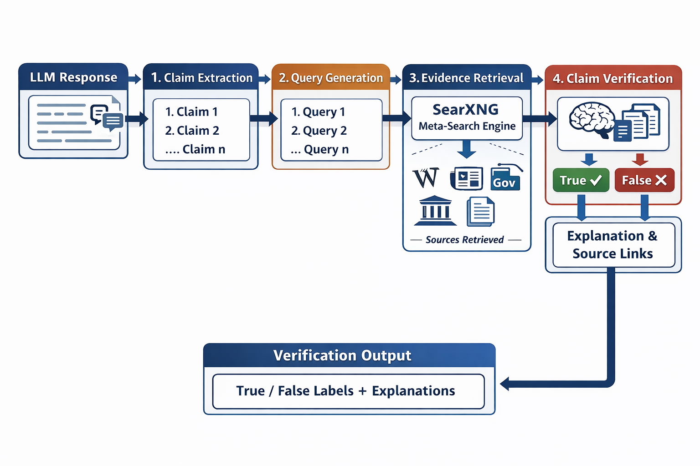
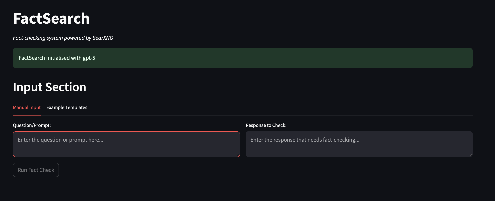

# FactSearch — Enhanced Fact-Checking Framework

**Images Here**

## Overview

FactSearch is an AI pipeline for verifying the factuality of LLM outputs. The pipeline consists of a four-step verification process:

1. **Claim Extraction**: Given an LLM-generated response, the system extracts atomic factual claims. 
2. **Query Generation**: For each extracted claim, the system generates search queries intended to retrieve relevant supporting or refuting evidence.
3. **Evidence Retrieval**: Evidence is retrieved using a locally-hosted instance of **SearXNG**, an open-source meta-search engine.
4. **Claim Verification**: For each claim, reteieved evidence snippets are provided to a language model for evidence-conditioned reasoning. 

The pipeline outputs the following information:

* Binary Claim Verification Labels (True/False)
* Per-Claim Explanatory Reasoning for each decision 
* Source Links retrieved via SearXNG - some examples of commonly occuring sources are: Wikipedia, online newspaper articles, independent media publications, government/public-sector webpages (e.g. NHS pages for healthcare-related information), scholarly articles, and technical documentation. The nature of the sources used will vary depending on the information which the user inputs to the pipeline. 
* TXT/JSON exports of all the above (optional)

FactSearch was developed at the University of Liverpool by Harry Mackenzie and Dr. Meng Fang. For more information, see our paper: ...

## AI Safety Disclaimer

FactSearch is a research project aimed at improving AI transparency and safety for decision-making scenarios, though it is important to acknowledge that it can make incorrect assumptions and fail to flag unfactual material. **Please do your due diligence in thoroughly checking LLM outputs, especially when this information is influencing important decisions.** FactSearch is intended only as a support tool and ultimately is not as a substitute for human intuition and expertise. 

## How to use FactSearch

Users can interact with FactSearch either via the command line, or through the web-based GUI included in this repositary. 

### Instillation & Quick-Start

### FactSearch GUI

Upon load, users will be prompted to select an AI model which will be used for reasoning tasks within the verification pipeline. There is a choice of OpenAI models (which require an API key) or the open-source Ollama model. 

The OpenAI models that FactSearch currently supports are:

1. GPT-5 
2. GPT-5-mini
3. GPT-5.2 

To run FactSearch with a GPT model, you will require an OpenAI API key, which you can get [here](https://developers.openai.com/api/docs/quickstart/).

You can find more info on OpenAI's models [here](https://developers.openai.com/api/docs/models).

Alternatively, users can choose to use the open-source model Ollama, in which case they will not require an API key and FactSearch will be completely free to use. 

Once FactSearch is initialised, users will be prompted for two inputs:

* Prompt/Question: Enter here the prompt that you passed to the LLM.
* Response to Check: Enter here the the LLM's response to your prompt. 

Once these fields have been filled, you will be able to use the button within the panel to run the fact checking pipeline and your results will be ready to review within a few moments. 

*** Image here showing example outputs ***

## Technical

### SearXNG Configuration and Language Model Selection
Search engine configuration and effects of search engine blocks on the system, built in mitigation measures (XNG wrapper pausing) - maybe add this into the app?? 
OpenAI model selection + thoughts on relative model performance (mention temperature needing to be set to 1)
Additional NLP model integration (OLlama probably)

## Credits

## Acknowledgements

Parts of the claim extraction and verification logic are adapted from [FacTool](https://github.com/GAIR-NLP/factool) (Chern et al., 2023), specifically the YAML prompt templates and OpenAI wrapper utilities (which have undergone modification to support current GPT models). All search infrastructure, evidence retrieval, UI components, and local model integration are original contributions.

This project was developed at the University of Liverpool, and I would like to thank Dr. Meng Fang for his invaluable support and contributions to the project. You can find more of his work here: https://mengfn.github.io

**Reference:**
> Chern, I., Chern, S., Chen, J., Yuan, W., Feng, K., Qin, C., ... & Liu, P. (2023). FacTool: Factuality Detection in Generative AI - A Tool Augmented Framework for Multi-Task and Multi-Domain Scenarios. *arXiv preprint arXiv:2307.13528*.